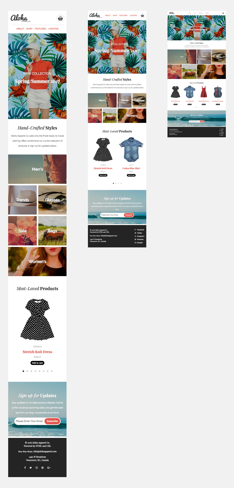

# Project 1 - Aloha Homepage 
This project focused on building a responsive homepage for a client called Aloha Apparel Co. It was built to accommodate the different screen sizes such as mobile, tablet and desktop.

### Cut off points
  - Mobile (Below 600px)
  - Tablet (Between 600px and 1240px)
  - Desktop (above 1240px)

### Screenshot
  